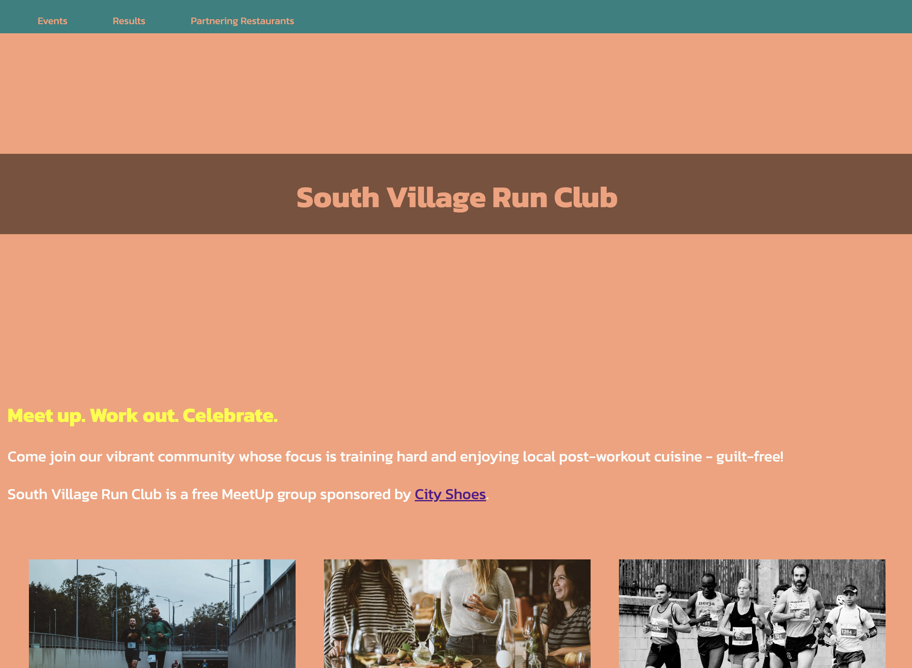

<!-- PROJECT SHIELDS -->
[![Contributors][contributors-shield]][contributors-url]
[![Forks][forks-shield]][forks-url]
[![Stargazers][stars-shield]][stars-url]
[![Issues][issues-shield]][issues-url]

<!-- TITLE -->
 

<a href="https://github.com/antancelin/ResponsiveRunClub_Codecademy"><h1 align="center">Responsive Run Club - Codecademy</h1></a>

  

    Made a responsive homepage for a running club using HTML and CSS. Codecademy project. 
    <a href="https://github.com/antancelin/ResponsiveRunClub_Codecademy"><strong>Explore the docs »</strong></a>
     
     
    <a href="https://github.com/antancelin/ResponsiveRunClub_Codecademy">View Demo</a>
    ·
    <a href="https://github.com/antancelin/ResponsiveRunClub_Codecademy/issues/new?labels=bug&template=bug-report---.md">Report Bug</a>
    ·
    <a href="https://github.com/antancelin/ResponsiveRunClub_Codecademy/issues/new?labels=enhancement&template=feature-request---.md">Request Feature</a>
  

<!-- TABLE OF CONTENTS -->

  
Table of Contents

  <ul>
    <li><a href="#about-the-project">About The Project</a>
    <li><a href="#website-link">Website Link</a></li>
    <li><a href="#built-with">Built With</a></li>
    <li><a href="#resources">Resources</a></li>
    <li><a href="#contact">Contact</a></li>
  </ul>

<!-- ABOUT THE PROJECT -->
## About The Project

 

Make a responsive homepage for a running club using HTML and CSS. Have to use flexbox and media queries.

(<a href="#readme-top">back to top</a>)

<!-- WEBSITE LINK -->
## Website Link

### [Responsive Run Club](https://antancelin.github.io/ResponsiveRunClub_Codecademy/)

(<a href="#readme-top">back to top</a>)

<!-- BUILT WITH -->
## Built With

* ![HTML5]
* ![CSS3]

(<a href="#readme-top">back to top</a>)

<!-- Resources -->
## Resources

* [Codecademy](https://www.codecademy.com/)
* [W3Schools](https://www.w3schools.com/)
* [MDN Web Docs](https://developer.mozilla.org/en-US/)
* [Google Fonts](https://fonts.google.com/)

(<a href="#readme-top">back to top</a>)

## Contributors:

* <a href="https://github.com/antancelin/">
  
Antoine ANCELIN

</a>

(<a href="#readme-top">back to top</a>)

<!-- CONTACT -->
## Contact

Antoine ANCELIN - ancelin.ant@gmail.com - [linktr.ee/antancelin](https://www.linktr.ee/antancelin)
 
 
[![twitter-shield]][twitter-url] 
 
[![github-shield]][github-url]
 
[![linkedin-shield]][linkedin-url]

Project Link: [https://github.com/antancelin/ResponsiveRunClub_Codecademy](https://github.com/antancelin/ResponsiveRunClub_Codecademy)

(<a href="#readme-top">back to top</a>)

<!-- MARKDOWN LINKS & IMAGES -->
<!-- https://www.markdownguide.org/basic-syntax/#reference-style-links -->
[contributors-shield]: https://img.shields.io/github/contributors/antancelin/ResponsiveRunClub_Codecademy
[contributors-url]: https://github.com/antancelin/ResponsiveRunClub_Codecademy/graphs/contributors
[forks-shield]: https://img.shields.io/github/forks/antancelin/ResponsiveRunClub_Codecademy
[forks-url]: https://github.com/antancelin/ResponsiveRunClub_Codecademy/network/members
[stars-shield]: https://img.shields.io/github/stars/antancelin/ResponsiveRunClub_Codecademy
[stars-url]: https://github.com/antancelin/ResponsiveRunClub_Codecademy/stargazers
[issues-shield]: https://img.shields.io/github/issues/antancelin/ResponsiveRunClub_Codecademy
[issues-url]: https://github.com/antancelin/ResponsiveRunClub_Codecademy/issues
[linkedin-shield]: https://img.shields.io/badge/LinkedIn-0077B5?style=for-the-badge&logo=linkedin&logoColor=white
[linkedin-url]: https://linkedin.com/in/antancelin
[twitter-shield]: https://img.shields.io/badge/Twitter-1DA1F2?style=for-the-badge&logo=twitter&logoColor=white
[twitter-url]: https://twitter.com/antancelin
[github-shield]: https://img.shields.io/badge/GitHub-100000?style=for-the-badge&logo=github&logoColor=white
[github-url]: https://github.com/antancelin
[HTML5]: https://img.shields.io/badge/HTML5-E34F26?style=for-the-badge&logo=html5&logoColor=white
[CSS3]: https://img.shields.io/badge/CSS3-1572B6?style=for-the-badge&logo=css3&logoColor=white
